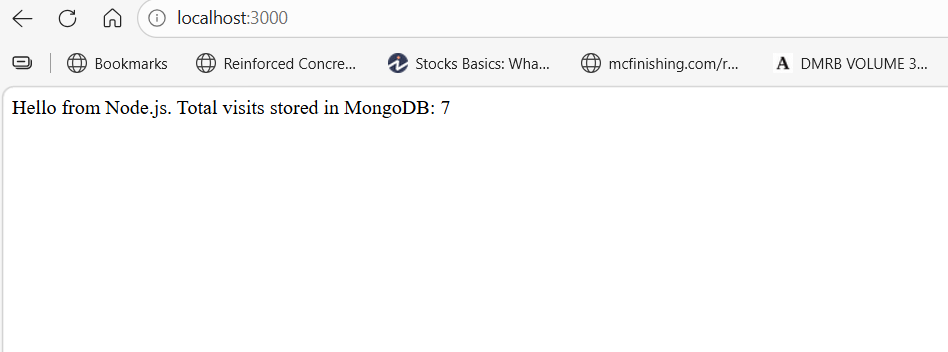
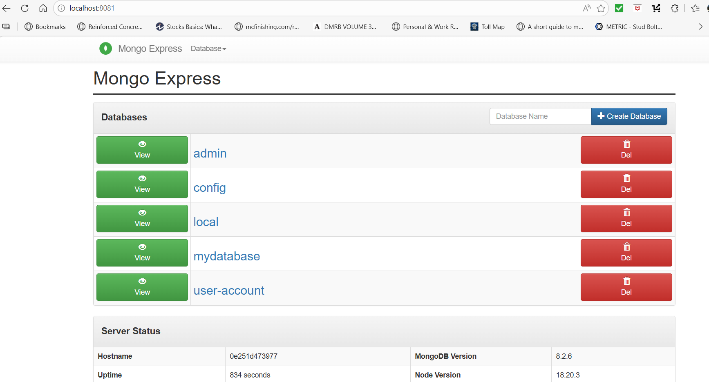
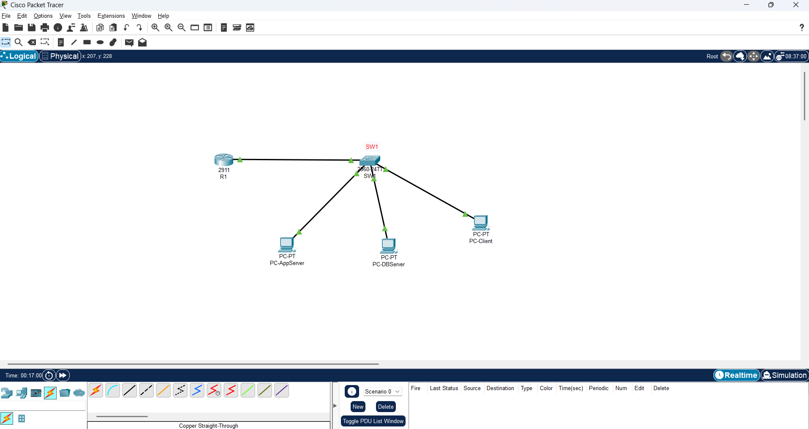

# Full-Stack Network Project
### Node.js + MongoDB + Docker + Cisco Network Simulation

A portfolio project demonstrating full-stack development skills
combined with enterprise network design knowledge.

---

## 🗺️ Project Overview

This project combines two key areas:

1. **A containerized full-stack web application** built with
   Node.js and MongoDB, orchestrated with Docker Compose
2. **A simulated enterprise LAN** built in Cisco Packet Tracer
   with VLANs, inter-VLAN routing, and network segmentation

The Docker network design **deliberately mirrors** the Cisco
network topology — demonstrating an understanding of how
applications sit within real network infrastructure.

---

## 🏗️ Architecture

### Docker mirrors the network:
| Docker Network | Maps To | Subnet |
|----------------|---------|--------|
| app-network | VLAN 10 | 192.168.10.0/24 |
| db-network | VLAN 20 | 192.168.20.0/24 |

---

## 🛠️ Technologies Used

| Technology | Purpose |
|------------|---------|
| Node.js | Backend web server |
| MongoDB | NoSQL database |
| Docker | Application containerization |
| Docker Compose | Multi-container orchestration |
| Cisco Packet Tracer | Network simulation |
| VLANs | Network segmentation |
| Router-on-a-Stick | Inter-VLAN routing |

---

## 📁 Project Structure

---

## 🚀 Running the Application

### Prerequisites
- Docker and Docker Compose installed
- Git

### Steps
```bash
# Clone the repository
git clone https://github.com/YOUR_USERNAME/node-mongo-stack.git

# Navigate into the project
cd node-mongo-stack

# Start all services
docker compose up --build
```

### Access the app
- **Node.js App** → http://localhost:3000
- **Mongo Express UI** → http://localhost:8081

---

## 🌐 Network Design

### VLAN Segmentation
| VLAN | Name | Subnet | Role |
|------|------|--------|------|
| 1 | Default | 192.168.1.0/24 | Client |
| 10 | APP-NETWORK | 192.168.10.0/24 | App Server |
| 20 | DB-NETWORK | 192.168.20.0/24 | Database |

### Why VLANs?
Separating the application and database into different VLANs
improves security — the database is not directly reachable
from the client network without passing through the router,
where access control rules can be applied.

---

## 📸 Network Topology


---


## 📸 Screenshots

### Node.js App (localhost:3000)


### Mongo Express Database UI (localhost:8081)


### Network Topology (Cisco Packet Tracer)


## 👨‍💻 Author
Roland Neequaye — Full-Stack Developer with networking knowledge


